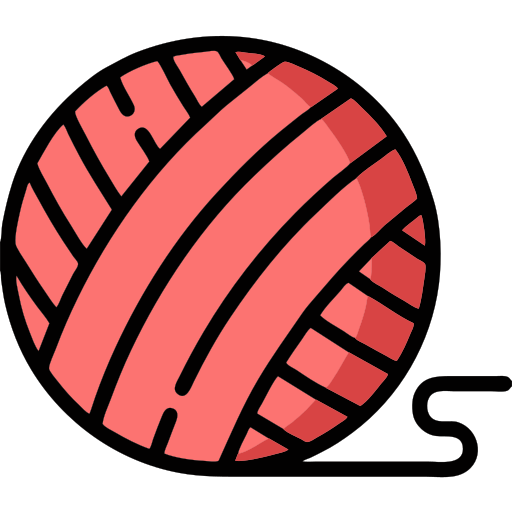
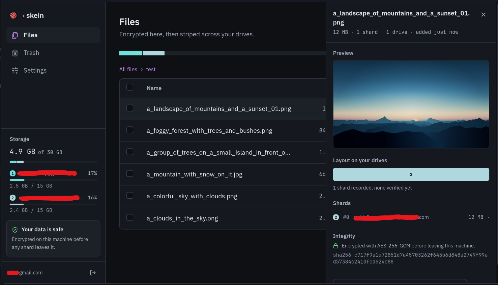
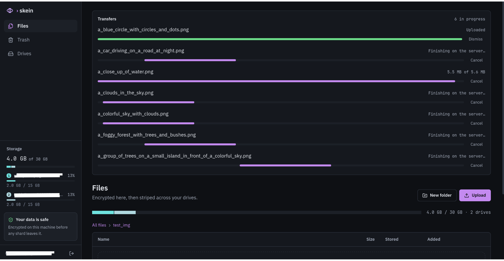
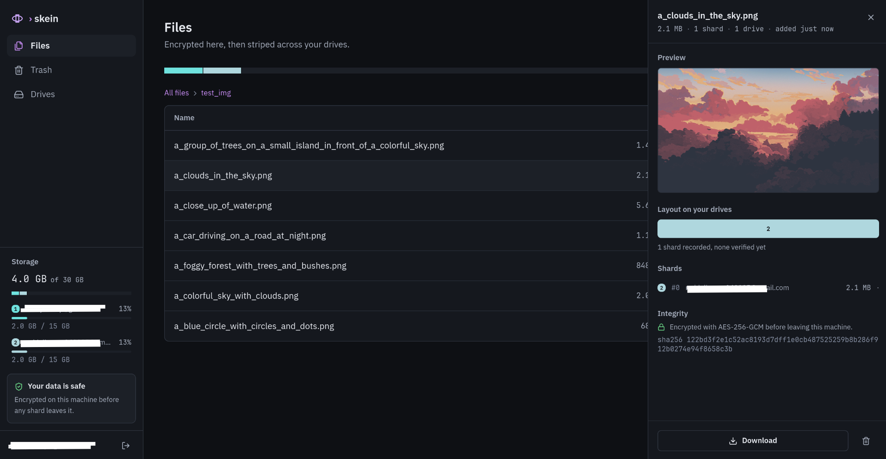
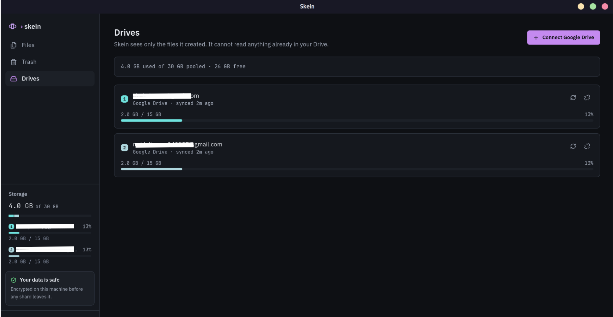

<samp>

<p align="center">

</p>

<h1 align="center">Skein</h1>

<p align="center">
<b>75 GB of free cloud storage that cannot hold a 30 GB file.</b>
</p>

<p align="center">
Pool fragmented cloud drives into a single encrypted storage array.
</p>

<p align="center">
  <a href="https://github.com/mridul249/Skein/actions/workflows/ci.yml">
    
  </a>
  
  
  
</p>


```text
         one file  ─┬─►  ████████  drive 1
                    ├─►  ████████  drive 2
                    └─►  ████      drive 3

                    s k e i n
```


## Why Skein?

If you have ever tried to combine multiple free Google Drive accounts into a single pool of storage, you have likely run into the same hurdles as existing options: **files cannot span across accounts, encryption breaks media seeking, tools demand full access to your personal drive, or losing your local index database permanently destroys access to your data.**

I built Skein to solve these structural issues in a single static binary.


Five free Google accounts give you 75 GB of total storage, but they operate as isolated 15 GB silos. You are forced to manually manage file splits, and a single large file-like a 30 GB raw video archive or virtual machine image-simply has nowhere to land.

**Skein** pools your fragmented cloud drives into a unified storage array. It automatically stripes large files across multiple accounts when no single drive fits, encrypts everything client-side before it leaves your machine, and packages the entire runtime into a single Go binary with an embedded web interface.
 
```
$ skein status
──────────────────────────────────────────────────────
 ▓▓▓▓▓▓▓▓▒▒▒▒▒░░░░░  38.2 / 75 GB          4 drives

 archive.tar.zst   28.4 GB   ●●●    3 shards, 3 drives
 video.mkv          4.1 GB   ●      1 drive
 notes.md            12 KB   ●      1 drive

```

*Skein (noun): a coiled length of yarn. Files are woven across multiple accounts.*

---

## Screenshots
<p align="center">

</p>

<p align="center">


</p>

<p align="center">

</p>

---

### Core Innovations (The "Cloud RAID" Engine)

* **RAID-0 Block Striping for the Cloud:** Skein completely shatters the 15 GB free-tier limit. By cutting massive files into smaller chunks and striping them across multiple Google Drive accounts, it creates a single, boundless virtual drive.


* **Zero-Knowledge Envelope Encryption:** Your data is secured locally before it ever touches a network. Skein utilizes advanced Key Derivation Functions (KDF) and envelope encryption, ensuring Google cannot scan, read, or flag your private files.


* **Constant-Memory Streaming:** Upload and download 50 GB+ files on hardware with minimal RAM. Skein’s chunking engine maintains a strict memory ceiling, preventing memory leaks or system crashes during massive I/O operations.


* **Hyper-Converged Single Binary:** No Node.js environments, no Docker Compose spaghetti, no external database dependencies. The entire backend, database driver, and embedded web interface compile down into one single, portable Go binary.


### Security & Privacy

* **Strict `drive.file` Scope:** Unlike tools that demand full, read-all access to your personal Google Drive, Skein operates on the principle of least privilege. It can only see and access the files it explicitly creates.
* **Instant Encrypted Media Seeking:** Traditional cloud encryption forces you to download a massive file entirely just to watch the last 5 minutes. Skein utilizes AES-256-GCM with 64 KiB framing, allowing you to instantly seek and stream video directly from the encrypted cloud.


* **Advanced OAuth & Token Families:** Built with secure PKCE OAuth flows and token family tracking to prevent session hijacking and ensure secure handoffs.


### Reliability & Recovery

* **Automated Disaster Rehearsals:** A lost local database usually means a dead encrypted drive. Skein includes built-in backup dumpers and automated restore-rehearsal scripts to guarantee your encryption keys and file manifests are recoverable.


* **Self-Describing Manifests:** Skein generates detailed cryptographic manifests mapping exactly where each chunk of a striped file lives, ensuring data integrity during parallel reconstruction.


* **Dual-Database Engine:** Scales from a zero-config local SQLite instance for personal desktop use, all the way up to a PostgreSQL-backed engine for heavy-duty server deployments.


### Interface & UX

* **Native Cross-Platform Desktop App:** Utilizing the Wails framework, Skein hooks directly into native OS features (system tray, file dialogs, and clipboard) for a seamless desktop experience across macOS, Windows, and Linux.

* **Embedded React Web UI:** Prefer the browser? Skein serves a sleek, modern web interface directly from the binary itself, complete with a beautiful frontend and real-time state management.


---

### Technical Comparison

Existing storage aggregators force a trade-off between deployment complexity, file striping capabilities, encryption, and data safety:

| Feature | rclone (`union` + `crypt`) | 9drive / DriveConnect | **Skein** |
| --- | --- | --- | --- |
| **Storage Pooling** | Yes | Yes | **Yes** |
| **Large-File Striping** | No | No | **Yes** |
| **Encrypted by Default** | Opt-in overlay | No | **Yes (Framed Envelope GCM)** |
| **Media Seeking & Previews** | High latency (large chunks) | Full download required | **Instant (64 KiB frames)** |
| **Data Recovery Architecture** | Lost if local index is wiped | Central DB reliant | **Automated Rehearsals & Self-Describing Manifests** |
| **Privacy Scope** | Full Drive Access | Full Drive Access | **`drive.file` scope only** |
| **Deployment Footprint** | Binary + complex config | MySQL + 2x Node + Compose | **One single binary** |


---
## The Engine: Polymorphic Server Architecture

At its core, Skein is driven by a unified Go application runtime (`internal/app/app.go`) that operates polymorphically - running either as a headless daemon (`cmd/skein`) or seamlessly wrapped inside a cross-platform desktop UI (`cmd/skein-desktop` via Wails). 

Instead of relying on external proxies, process managers, or heavy system dependencies, Skein handles its own network binding, asset distribution, and concurrent background tasks:

* **Ephemeral Network Binding:** When running as a desktop app, Skein's HTTP server dynamically binds to an available loopback port (`127.0.0.1:0`). This eliminates local port collisions, allowing multiple desktop instances or background daemons to coexist without configuration tweaks.
* **Autonomous Background Subsystem (`internal/worker/worker.go`):** Non-blocking goroutine loops handle array state management asynchronously. The worker engine continuously executes background routines - including `quota-sync` (polling storage capacity across drives), `reclaim-reservations` (releasing unused file chunks), `purge-oauth-states`, and `purge-sessions` - ensuring background cleanup never blocks active file I/O.
* **In-Process OAuth Loopback (`internal/desktopoauth/loopback.go`):** Rather than embedding login pages inside webviews, Skein boots an ephemeral, RFC 8252-compliant local HTTP listener to capture authorization codes directly from the user's default system browser, completing PKCE verification securely in memory.
* **Zero-Dependency SPA Serving (`internal/web/embed.go`):** The compiled Vite/React frontend is embedded directly into the Go binary at compile time (`//go:embed all:dist`). Skein serves these assets in-memory with SPA routing fallbacks and immutable caching headers (`Cache-Control: public, max-age=31536000`), eliminating the need for Nginx or Apache.
* **Deterministic Graceful Teardown:** During process termination (`SIGINT`/`SIGTERM`), Skein executes a controlled, zero-data-loss shutdown sequence: it drains active HTTP connections (`httpSrv.Shutdown`), blocks until in-flight background worker routines finish (`workers.Wait()`), and safely flushes and closes database connection pools.

---

## Design Constraints & Tradeoffs

Every architecture is a series of compromises. Skein unapologetically trades convenience for raw capacity and absolute client-side privacy:

* **Capacity Over Parity (The RAID-0 Tradeoff):** Skein stripes blocks without parity to maximize your free storage pool. **The tradeoff:** If Google suspends one account, the files spanning it are lost. Skein is a high-capacity virtual drive, not a fault-tolerant backup vault.


* **Privacy Over Collaboration:** Client-side envelope encryption makes generating simple "share links" mathematically impossible without compromising zero-knowledge guarantees. Your data is a vault, not a drop-box.


* **Depth Over Breadth (The Google MVP):** We exclusively target Google Drive’s massive 15 GB free tier first. Mastering its aggressive API rate limits and 64 KiB frame streaming ensures future S3 integration will be trivial.


* **Heavy Compute Over Thin Clients:** Skein is a desktop-bound storage controller. Managing concurrent chunk multiplexing, local AES-256 encryption, and persistent SQLite state requires desktop-class I/O, not a mobile app.


---

## Quickstart

Docker is the only dependency. No Go, no Node, no Postgres to set up.

```bash
git clone https://github.com/mridul249/Skein.git && cd Skein
cp .env.example .env      # set the two Google OAuth values
docker compose up
```

Open <http://localhost:8080>.

**Then read `data/skein-setup-info.txt`.** It records the master key Skein
generated for you, and that file is **the only copy** - lose it and every
uploaded file becomes permanently unreadable. Move it into a password manager
before you upload anything.

Google OAuth credentials are the only thing you have to supply; they cannot be
generated. [docs/SETUP.md](docs/SETUP.md) §3 walks through creating them, and
[docs/DOCKER.md](docs/DOCKER.md) covers volumes, TLS and the rest.

### Desktop app

A native windowed binary, not a container. Build it with Docker so you do not
need Go, Node, GTK and WebKit installed:

```bash
docker build --target desktop --output type=local,dest=./bin .
./bin/skein-desktop
```

It needs its own **Desktop app** OAuth client, which is a different client from
the server's Web one and not interchangeable - see
[docs/SETUP.md](docs/SETUP.md) §3.

### Running from source

Building without Docker, running the test suites, and the `make` targets are
covered in [CONTRIBUTING.md](CONTRIBUTING.md).

---

## Verifying a download

Every release publishes `SHA256SUMS` covering every binary, and a Sigstore
signature over that file. The release build fails rather than publish an
artifact without a checksum.

**Check the bytes are intact:**

```bash
sha256sum -c SHA256SUMS
```

That catches corruption and truncation. It does not establish *who* built the
files: anyone who can replace a binary can replace the checksum file beside it.
For that, verify the signature.

**Check the release came from this repository's CI:**

```bash
# Once: https://docs.sigstore.dev/system_config/installation/
cosign verify-blob \
  --certificate SHA256SUMS.pem \
  --signature SHA256SUMS.sig \
  --certificate-identity-regexp '^https://github.com/mridul249/Skein/' \
  --certificate-oidc-issuer https://token.actions.githubusercontent.com \
  SHA256SUMS
```

Success means this file was signed by a GitHub Actions run in this repository,
recorded in the public Rekor transparency log. Because `SHA256SUMS` commits to
every artifact by hash, one signature covers the whole release.

**Why Sigstore and not GPG.** A GPG release key is a long-lived secret someone
has to hold, rotate, and not lose. The common failure is not a stolen key but a
forgotten one, after which signatures stop and users learn to ignore the
warning. Keyless signing has no secret to lose: the identity verified is
"GitHub Actions, this repository", which is the question anyone actually has.
The trade is that verification needs `cosign` and network access, so
`SHA256SUMS` stays useful on its own for anyone who will not install it.

**Reproducible builds.** Two clean checkouts of the same commit, built at
different paths, produce byte-identical binaries - verified 2026-08-06. This is
what `-trimpath` and `-buildvcs=false` in `scripts/release-artifacts.sh` are
for: without the latter, Go stamps `vcs.modified`, which differs between a
clean checkout and a dirty working tree. You can rebuild a tag yourself with
`make release` and compare against the published `SHA256SUMS`.

---

## Not in v1

Deliberately out of scope, so nobody files them as bugs.

| | Why |
| --- | --- |
| **Direct-from-disk uploads and parallel shard streams** | v2, behind the reservation rewrite. Uploads today stream through the browser one shard at a time. |
| **Multi-tenancy** - workspace invites, shared folders, public share tokens | Skein is self-hosted, one instance per person. The isolation machinery exists and is verified, but shipping sharing invites shared instances, and registration is open by default, the backup route dumps every user's `password_hash`, and the download directory is process-wide. That is a different product with a security surface this one was not built for. |
| **Removing a drive that still holds files** | Disconnect refuses and names the files instead. A file striped across two drives is destroyed by removing one, so cascading the delete would let "unlink an account" destroy data on a drive you did not touch. A deliberate remove-with-files needs its own confirmation naming the exact files, and is v2. |
| **Renaming or moving folders** | Manifests record the folder path as a snapshot of names, so a folder renamed after some files were uploaded reconstructs as two folders during recovery - contents split across both. Nothing is lost, but it appears at the moment you are least able to tolerate ambiguity. Correctness needs manifest staleness tracking, which is v2. |
| **Scheduled reconcile** | On-demand only. `reconciled_at` records when each file was last checked. |

Known smaller gaps are tracked in the issue register. The top polish item for
v1.1 is the account colour ramp, which collides with the semantic colours under
colour-vision deficiency - measured, documented, and the fix is known.

---

## Documentation Index

| Guide | Description |
| --- | --- |
| [docs/SETUP.md](docs/SETUP.md) | **Start here.** Prerequisites, OAuth for both client types, every setting, first run |
| [docs/DOCKER.md](docs/DOCKER.md) | Running with Docker, the generated master key, building the desktop binary |
| [docs/TROUBLESHOOTING.md](docs/TROUBLESHOOTING.md) | Exact error strings and what causes them |
| [docs/INSTALL.md](docs/INSTALL.md) | Step-by-step setup and OAuth client setup |
| [docs/CONFIGURATION.md](docs/CONFIGURATION.md) | Environment variables and runtime configuration |
| [docs/BACKUP.md](docs/BACKUP.md) | Disaster recovery, master key management, and manifest recovery |
| [docs/ARCHITECTURE.md](docs/ARCHITECTURE.md) | Shard routing, crypto specs, and quota calculations |
| [docs/SECURITY.md](docs/SECURITY.md) | Threat model, zero-knowledge guarantees, and scope isolation |
| [docs/DEVELOPMENT.md](docs/DEVELOPMENT.md) | Build steps, test runner execution, and contributing guidelines |

---

## License

This project is licensed under the Apache License 2.0 - see the LICENSE file for details.


</samp>